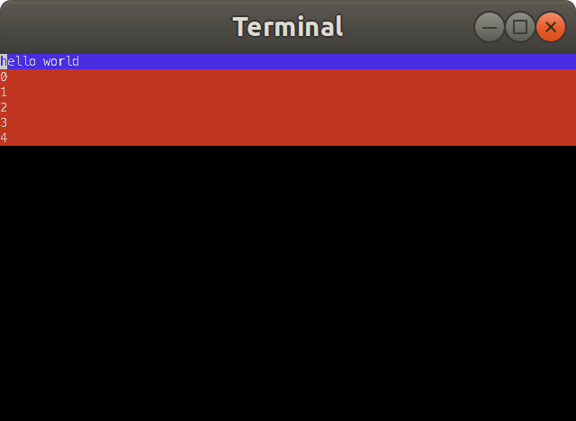

This repo is currently home to two related projects:

 - *reterm* - a reagent / react-like way of creating terminal interfaces
 - *terminal-todo* - a todo list app that runs in your terminal (built with reterm) 


# reterm

A clojure library for creating terminal applications in a react-like way. The API is similar to reagent.

Wraps [clojure-lanterna](https://github.com/multimud/clojure-lanterna/), which wraps [Lanterna](https://github.com/mabe02/lanterna).

Ex.

```clojure
(ns retermdemo.core
  (:require 
    [reterm.core :as r]))

(defn sub-view [ns]
  [:div {}
   (for [n ns]
     [:div {} (str n)])])

(defn app-view []
  [:div {:bg :red
         :on-keypress (fn [key _]
                        (println "pressed" key)
                        (case key
                          :escape (r/stop!)
                          nil))}
   [:div {:bg :blue} "hello" " " "world"]
   [sub-view (range 5)]])

(r/start! :swing [app-view])
```



# terminal-todo

When working on a project, I typically keep a todo-list in a browser-based task manager (Asana, github issues, etc.).
But, when coding, I live in tmux and I tend to keep a todo-list in vim in a tmux pane (it's "right there", faster, and more keyboard friendly than the browser-based alternative).  But now I have two lists, and I have to manually sync them. Ugh!

Hence... a terminal todo-list app, with a pluggable backend (filesystem, Asana, github issues, etc.)

Built using clojure

To run in terminal:
`lein run`

To run in swing:
`lein run :swing`

To run repl:
`lein repl`


